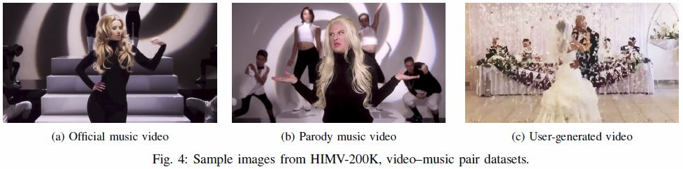
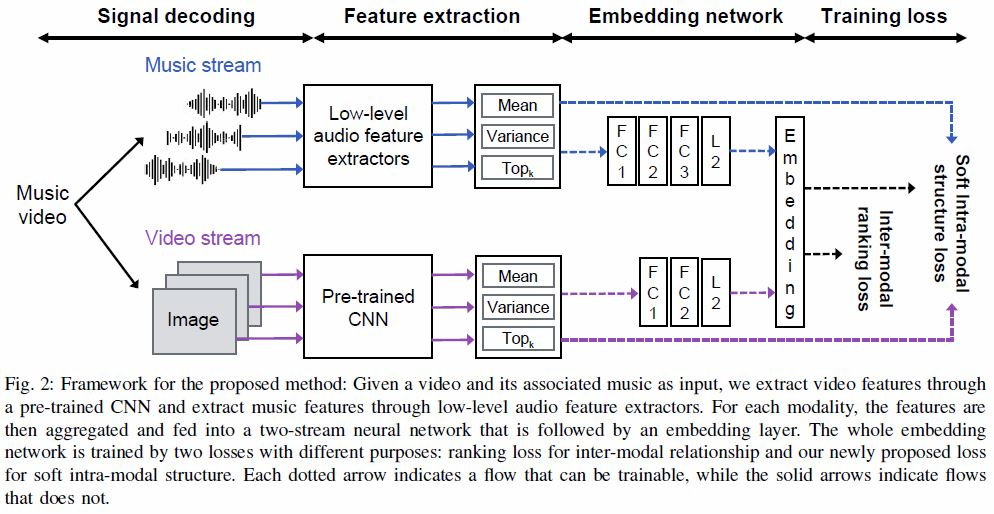
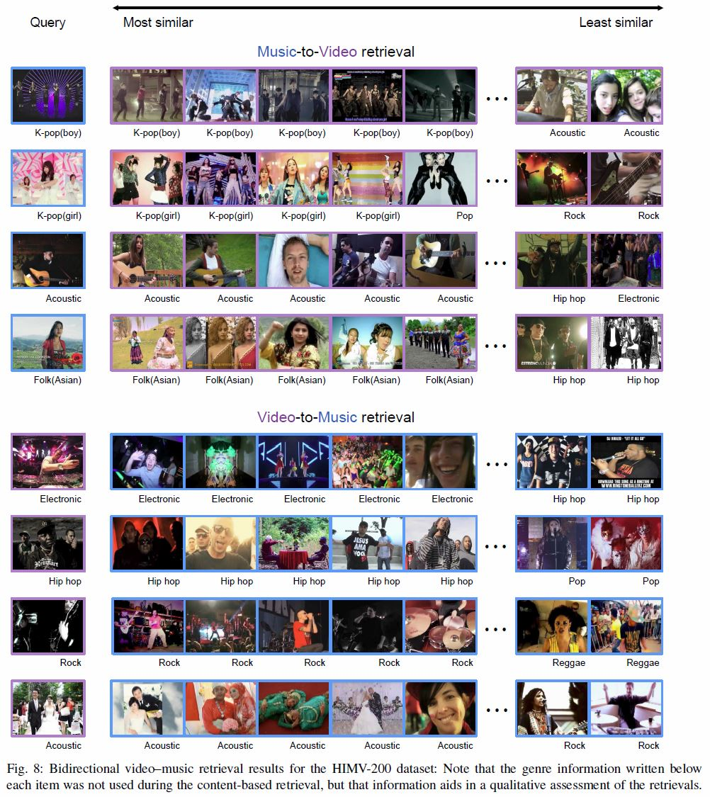

VM-NETin Tensorflow
====

Tensorflow implementation of [SSPP-DAN: Deep Domain Adaptation Network for Face Recognition with Single Sample Per Person](https://arxiv.org/abs/1704.06761)


Prerequisites
-------------
* [Python 2.7](https://www.python.org/downloads/)
* [Tensorflow 0.12](https://www.tensorflow.org/versions/r0.12/)
* [OpenCV 2.4.9](http://opencv.org/releases.html)
* [NumPy](http://www.numpy.org/)
* [SciPy](https://www.scipy.org/install.html)

Usage
-------------

First, download video dataset from "data/YoutubeID.txt." Then, extract audio features and video features from the videos. 


Network structure
-------------



To train a model with downloaded dataset:
```
$ python train.py
```

To test with an existing model:
```
$ python test.py
```

Results
-------------


